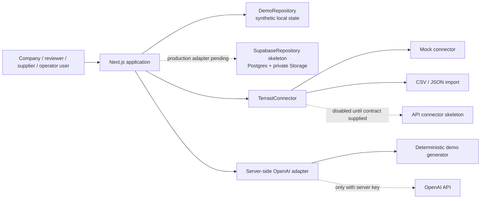
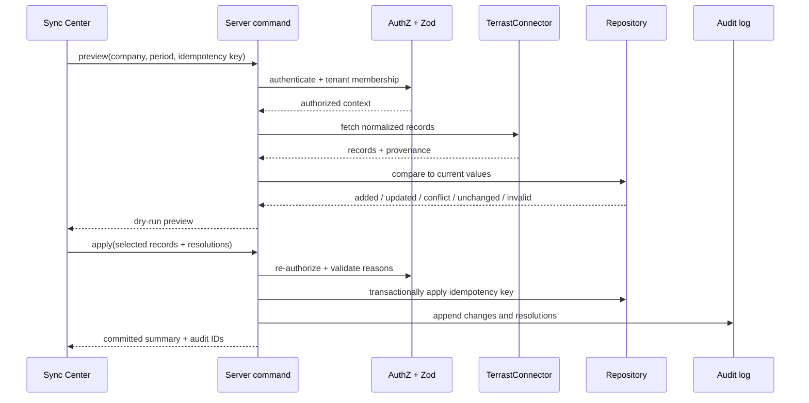

# Architecture

## 1. Architectural goals

The architecture makes the complete demo usable without external credentials while preserving production seams for Supabase, OpenAI, and a future authorized TERRAST API. Tenant separation, provenance, review history, and deterministic behavior are domain constraints rather than UI conventions.

## 2. System context

The diagram does not assert a TERRAST endpoint or a JPX integration. JPX is a prospective stakeholder for the concept demonstration, not an integrated system.

## 3. Runtime layers

| Layer                | Responsibility                                                                             | Must not do                                                                                  |
| -------------------- | ------------------------------------------------------------------------------------------ | -------------------------------------------------------------------------------------------- |
| UI/routes            | rendering, input collection, navigation, accessible state feedback                         | decide tenant authorization, calculate business results ad hoc, use service-role credentials |
| Application services | orchestrate sync, disclosure, review, supplier, transition, AI, report use cases           | depend on React or browser-only APIs                                                         |
| Domain               | entities, status transitions, permission rules, calculations, scoring, diff/conflict logic | perform network/storage access                                                               |
| Ports                | repository, connector, AI generator, clock/ID abstractions                                 | encode provider-specific payloads in domain types                                            |
| Adapters             | DemoRepository, SupabaseRepository, mock/import/API connector, OpenAI/deterministic AI     | bypass validation or tenant checks                                                           |
| Infrastructure       | Supabase Auth/Postgres/Storage, Vercel runtime, observability/rate limit                   | expose secrets to the browser                                                                |

## 4. Operating modes

### Demo mode

`NEXT_PUBLIC_DEMO_MODE=true` selects a synthetic repository and deterministic AI output. State may persist in browser storage for the demo, but must be namespaced/versioned and resettable. Demo role switching is a presentation feature, not authentication. All records identify their synthetic source.

### Supabase mode

With valid Supabase public configuration and `NEXT_PUBLIC_DEMO_MODE=false`, the app uses Supabase Auth, rejects untrusted roles, hides demo role switching, and guards routes. The AI server route additionally re-queries company membership and every metric/evidence/requirement ID under the user's RLS context before any provider call; only then may a service client append AI/audit provenance.

The general `SupabaseRepository` schema mapper and validated server commands for non-AI workspace mutations are deliberately fail-closed skeletons in this MVP. Until those adapters are implemented and remote RLS tests pass, authenticated mode is not a production data workspace: non-AI screens still show synthetic browser state. This is a production gate, not a claimed completed integration.

### TERRAST connector modes

- `mock`: deterministic synthetic records.
- `csv` / `json`: validated import using the same normalized connector output.
- `api`: skeleton that fails closed until an authorized contract is configured.

## 5. Core command flow (production target)

Demo Sync Center already calls `MockTerrastConnector`, the pure domain preview/apply logic, and `DemoRepository` transaction/idempotency persistence. The sequence above is the required Supabase implementation target; it is not yet fully wired for every non-AI command.

## 6. Authorization boundaries

- `tenant_id` is immutable on `organizations`; child rows carry `organization_id`.
- Database RLS is defense in depth for direct Data API access. It uses `TO authenticated` plus a membership/ownership predicate.
- Application authorization is mandatory even when using RLS, especially for service-role calls, field-level restrictions, aggregate queries, consent decisions, supplier invitations, and external-assurer assignments.
- Platform operator reads are separate: aggregate/anonymous projections are preferred, company summary requires active scoped consent, and detail tables remain same-tenant.
- Evidence uses object paths beginning with organization ID and a private bucket. The migration enforces Storage access; an authorized signed-URL server command is a production target and is not wired in this demo UI.

## 7. Data and consistency

- Repository commands write the domain record and audit event in one transaction where supported.
- Sync uses `(organization_id, idempotency_key)` uniqueness. Repeating the same successful request returns the prior result rather than duplicating metric values.
- Source records have stable connector IDs. Manual and connector values remain distinguishable.
- Approval, AI, sync-record, and audit histories are append-only. A reversal is a new event, not destructive editing.
- Timestamps are stored as `timestamptz`; reporting dates remain explicit `date` values. Display defaults to Asia/Tokyo.

## 8. AI boundary

Public Demo Mode always uses the deterministic generator, even if an API key is accidentally present. It allowlists demo task/label/unit vocabulary before producing prose so arbitrary client wording is not echoed as an endorsement. In authenticated mode, the server ignores client-provided facts: it verifies company membership, reloads current/prior metric values, requirement summary, and evidence IDs through RLS, hashes the authoritative packet, and rejects cross-company or missing IDs. OpenAI output is Zod-validated and every cited ID must be a subset of that permitted packet. Success, insufficient evidence, and validation/provider failure append AI provenance and an audit event atomically through a service-role-only, `SECURITY INVOKER` RPC after authorization. Provider errors never mutate an approved response.

## 9. Failure handling and observability

- Domain/validation errors return stable public codes and field issues.
- Unexpected errors return a generic message and correlation ID; stack traces and provider bodies stay server-side and are redacted.
- Connector timeouts/retriable failures mark jobs failed with a safe error code. Retry creates a linked job and reuses an explicit idempotency strategy.
- Audit logs record security-relevant actions; operational logs are separate and must not contain evidence payloads or secrets.
- Production should add structured traces, rate-limit telemetry, security alerts, backup/PITR monitoring, and retention controls.

## 10. Deployment topology

The current deployment target is a synthetic Demo Mode Next.js project on Vercel with no remote data credentials. A future Supabase-mode topology requires an approved Supabase region/project and optional server-side OpenAI calls. Preview deployments use synthetic or explicitly non-production data. Supabase-mode promotion additionally requires migration verification and RLS negative tests; every mode requires environment review and smoke testing. See [DEPLOYMENT.md](./DEPLOYMENT.md).

## 11. Architecture decisions

1. **Repository and connector ports:** preserve offline demo value and make provider replacement testable.
2. **No invented TERRAST contract:** API adapter is fail-closed until documented inputs exist.
3. **Postgres RLS plus server authorization:** neither browser role state nor `TO authenticated` is sufficient alone.
4. **Membership table as authorization source of truth:** trusted `app_metadata` is reserved for coarse system administration; `user_metadata` is never trusted.
5. **Private evidence bucket and ephemeral URL:** prevents long-lived access tokens from becoming records.
6. **Original requirement summaries:** avoids copying standards while retaining version/source traceability.
