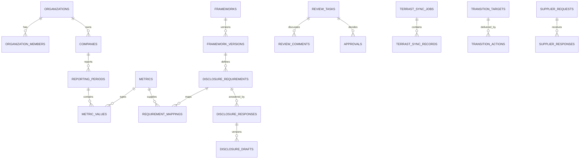

# Data Model

## 1. Tenant model

`organizations` is the tenancy root. Its immutable `tenant_id` represents the security boundary; all tenant-owned child rows use `organization_id` as a foreign key. This avoids propagating a mutable business slug or company code into authorization.

Users may belong to multiple organizations through `organization_members`. Membership role and `is_active` are the database source of truth. Global catalogs use a nullable `organization_id`: `NULL` is system-managed, while a UUID denotes a tenant extension.

Role IDs are shared with the TypeScript domain: `system_admin`, `platform_operator_demo_admin`, `company_admin`, `preparer`, `reviewer_approver`, `external_assurer_read_only`, and `supplier_user`.

Company identity and organization tenancy are separate, but the MVP enforces one company per company organization. This keeps organization-wide membership RLS equivalent to company scope. Supporting group/multi-company tenants requires an explicit member-to-company scope model before the uniqueness constraint is relaxed. Operational records still carry both `organization_id` and, where relevant, `company_id`.

## 2. Table catalog

| Table                      | Purpose                                                    | Tenant scope / mutation rule                                                      |
| -------------------------- | ---------------------------------------------------------- | --------------------------------------------------------------------------------- |
| `organizations`            | tenant root and immutable `tenant_id`                      | members read; company admin updates safe fields; create/delete server-only        |
| `organization_members`     | user-to-organization roles                                 | own/admin read; company admin manages local roles only                            |
| `user_profiles`            | user display preferences                                   | owner-only, with system-admin read when required                                  |
| `companies`                | fictional/authorized company identity                      | staff CRUD; consented platform operator gets summary SELECT only                  |
| `company_sharing_consents` | scoped, dated sharing grant                                | company-admin controlled; grantee operator can inspect its grant                  |
| `reporting_periods`        | company fiscal periods and baseline marker                 | tenant staff workflow                                                             |
| `frameworks`               | versionable framework family                               | global authenticated read; global system-admin write; tenant extensions isolated  |
| `framework_versions`       | source/version/effective date                              | same catalog rule                                                                 |
| `disclosure_requirements`  | ID, original short summary, fields, URL, version status    | same catalog rule; no standards prose                                             |
| `requirement_mappings`     | requirement ↔ metric/TERRAST field mapping                 | tenant staff or system-managed extension                                          |
| `metrics`                  | typed longitudinal metric catalog                          | global/tenant catalog rule                                                        |
| `metric_values`            | value, units, boundaries, provenance, confidence, reviewer | RLS same-tenant read; service-only audited manual upsert; no operator detail read |
| `emission_factors`         | named/versioned factors                                    | global/tenant catalog; seed factors marked demo                                   |
| `calculation_records`      | formula, inputs, factor, method/version, result            | same-tenant staff; immutable calculation evidence intent                          |
| `evidence_files`           | private Storage object metadata and entity link            | same-tenant staff; assigned assurer can read linked entity                        |
| `disclosure_responses`     | current response/status/readiness                          | same-tenant staff; assigned assurer read only                                     |
| `disclosure_drafts`        | versioned response snapshots and source IDs                | tenant staff; preserves AI generation link                                        |
| `review_tasks`             | assignment, due date, return/approval status               | preparer creates; assignee/reviewer transitions                                   |
| `review_comments`          | immutable comments and assignee-style mention              | authorized readers; Auth-user deletion nulls author ID without deleting history   |
| `approvals`                | append-only approve/return/revoke decision                 | reviewer insert; no client update/delete                                          |
| `risks_opportunities`      | risk/opportunity assessment and response                   | tenant staff                                                                      |
| `transition_targets`       | baseline, target, progress, status                         | tenant staff                                                                      |
| `transition_actions`       | action, investment, KPI, due/progress                      | tenant staff                                                                      |
| `supplier_requests`        | requested metrics, non-secret hint, expiry/status          | staff manage; assigned supplier reads                                             |
| `supplier_responses`       | value/evidence/status by request and metric                | assigned supplier or staff; tenant-bound request check                            |
| `marketplace_offerings`    | fictional offerings and matching rules                     | global authenticated read; system-admin write                                     |
| `terrast_sync_jobs`        | dry-run/apply job, mode, idempotency, safe error           | tenant staff; status may update                                                   |
| `terrast_sync_records`     | per-source diff, resolution, provenance                    | append-only tenant history                                                        |
| `ai_generation_logs`       | prompt/model/input hash/sources/output/actor/time          | append-only tenant provenance                                                     |
| `audit_logs`               | security/business before/after event                       | company/system admin read; reviewed service-only commands append                  |

The executable schema consists of [the initial migration](../supabase/migrations/20260712100436_init_terrast_schema.sql) and [the manual metric command migration](../supabase/migrations/20260712143139_save_manual_metric_value_with_audit.sql). A supporting `supplier_invitation_secrets` table stores only invitation-token hashes. It has forced RLS, no anon/authenticated privilege or policy, and explicit service-only access for a validated server workflow.

## 3. Key relationships

## 4. Metric provenance contract

Each `metric_values` record separates:

- canonical `value_json`, `normalized_value`, and `unit`;
- `original_value` and `original_unit`;
- `consolidation_scope` and `organizational_boundary`;
- `source_type`, `source_system`, stable `source_record_id`, and optional source-document reference;
- `imported_at`, `last_updated_at`, confidence, verification state, owner, reviewer, and change reason;
- `manual_override` and a positive `version` used for optimistic concurrency.

The implemented manual-entry command identifies one logical row by organization, company, reporting period, metric, `source_system=manual_entry`, and a stable manual source-record ID. Create requires `expectedVersion=0`; update locks the row and requires the exact current positive version. It cannot overwrite non-manual provenance. The same database transaction writes an append-only audit event containing the version, unit, change reason, and SHA-256 value hash rather than the raw metric value.

Evidence content stays in private Storage. `evidence_files` holds the bucket/object path, file metadata/hash, and linked domain entity; it never persists a signed URL.

## 5. Status and history

- Disclosure response: `not_started`, `data_available`, `drafted`, `in_review`, `revision_requested`, `approved`, `not_applicable`.
- Sync record: `added`, `updated`, `conflict`, `unchanged`, `invalid` with optional explicit `terrast`, `manual`, or `skip` resolution.
- Approval history is append-only; cancellation/revocation is a new decision.
- Evidence uses soft deletion metadata. Production deletion must coordinate object removal, retention/legal hold, audit event, and export obligations.

## 6. RLS model

All 30 required public tables plus the service-only invitation-secret support table have RLS enabled and forced. `anon` has no application-table grants. Policies target `authenticated` and evaluate membership/ownership. Update policies include SELECT plus `USING` and `WITH CHECK`. Authenticated clients have no hard-delete privilege, and append-only tables additionally revoke UPDATE; validated server workflows perform retention/deletion operations.

The few recursion-breaking membership/consent/assignment lookups that need `SECURITY DEFINER` live only in non-exposed `private`, verify `auth.uid()`, use an empty `search_path`, and have constrained grants; the remaining helpers use `SECURITY INVOKER`. The `private` schema must never be added to Supabase's exposed schemas. `public.append_ai_generation_with_audit` and `public.save_manual_metric_value_with_audit` are `SECURITY INVOKER`; execution is revoked from PUBLIC/anon/authenticated and granted only to `service_role`. The already-authorized server routes can therefore append each domain record and its audit event atomically without a public definer-rights function. The manual metric RPC locks and rechecks the exact route-authorized role membership, company, open period, catalog/type/unit, and optimistic version inside the transaction, serializes its actor/tenant rate bucket, stores redacted value/reason/scope/boundary hashes, and returns the saved safe row atomically. Metric codes share the route's bounded ASCII contract, while the logical manual-row identity uses the immutable metric UUID so code renames cannot split optimistic-lock history. Service-role DELETE is revoked across application tables except invitation hashes, and Auth-user deletion retains review comments by setting their author reference to null.

`app_metadata.role=system_admin` is the only JWT metadata authorization shortcut. User-editable `user_metadata` is never used. Role changes require session/token refresh, and sensitive server commands re-query membership.

`/app/data` is the only non-AI screen currently mapped to this schema end to end: company/period/metric/value/evidence-ID reads use the authenticated RLS client, global/tenant metric resolution preserves the exact database metric ID, and the manual metric mutation uses the service-only atomic command after server authorization. Rows with missing source record, import time, original unit/value, scope, or boundary fail closed instead of receiving invented provenance. Production CSV/export and all other non-AI mutations remain fail-closed. These migrations and pgTAP assertions have not been applied or executed against a remote Supabase project, and remote database/security advisors have not been run.

## 7. Seed data

[seed.sql](../supabase/seed.sql) contains exactly three fictional companies plus a fictional platform-operator organization. Each company has three reporting years of synthetic Scope 1/2/3 data marked `terrast_mock` and `MockTerrastConnector`. Securities codes, factors, risks, targets, services, and values are demo artifacts and not real entities or official factors.

Auth users are deliberately not inserted by SQL seed. Demo identities belong to application demo state; real Supabase users and membership must be created through an authenticated/server-controlled onboarding process.
